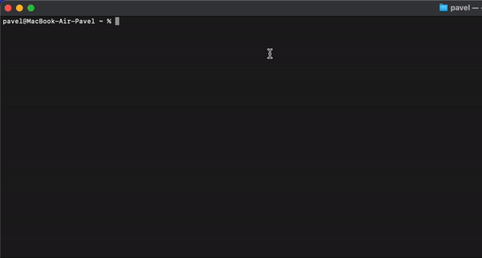

# CDH

### Description of the project

The project is a utility written in the Go and Bash programming languages that extends the command line capabilities when working with the file system. Specifically, the utility allows users to save all directory change operations (`cd`) to the history and subsequently easily return to any of the previous directories by calling it from the history. This is especially useful for developers, system administrators, and all those who periodically work with a large number of directories and need an effective way to navigate the file system.

#### The main functions and characteristics of the project:

1. **Record the history of transitions:**
- Automatically save each `cd` command to the history with the path indication.

2. **History Management:**
- The ability to view the full list of transitions.

3. **Quick Transition:**
- Allows users to return to any previously visited directories by simply selecting them from the history.

4. **Command Line Interface (CLI):**
- Intuitive commands for working with the history and transitions between directories.

5. **Configuration and customizability:**
- The ability to customize the settings for saving history.

### The usefulness of the project

#### Increase productivity and efficiency:

1. **Time Saving:**
- Reduces the time needed to navigate complex directory structures, especially in large projects.

2. **Ease of use:**
- Allows you not to remember long and complex paths to directories, relying on the history of transitions.

3. **Error reduction:**
- Reduces the number of errors associated with incorrect path entry, as transitions can be performed automatically.

#### Workflow improvement:

1. **Multitasking support:**
- Easy return to previously active working directories contributes to more efficient multitasking.

2. **Flexibility:**
- Allows you to quickly switch between different work contexts (for example, directories of different projects), which is useful for developers working on several projects at the same time.

3. **Historical analysis:**
- Allows you to analyze the history of transitions to optimize the directory structure and improve personal work habits.

### Installation

Currently, to use this library, you need to download it and run the `make build-zsh` command from the project folder. Now it supports working with both `zsh` and `bash`.

### Using

#### CDI (standard)
```
pavel@MacBook-Air-Pavel ~ % pwd
/Users/pavel
pavel@MacBook-Air-Pavel ~ % cdi
Select the directory to navigate to:
1: /
2: /Users/pavel
3: /usr
4: /usr/local/bin
5: /Users/pavel
6: /etc
7: /Users/pavel
Enter the directory number: 4
pavel@MacBook-Air-Pavel bin % pwd
/usr/local/bin
```

#### CDI (fzf)


#### CDH
```
pavel@MacBook-Air-Pavel ~ % pwd
/Users/pavel
pavel@MacBook-Air-Pavel ~ % cdh 3
pavel@MacBook-Air-Pavel /usr % pwd
/usr
```

#### CLEAR
```
pavel@MacBook-Air-Pavel ~ % go-dir list
1: /
2: /Users/pavel
3: /usr
pavel@MacBook-Air-Pavel ~ % go-dir clear
pavel@MacBook-Air-Pavel ~ % go-dir list
```

#### LIST
```
pavel@MacBook-Air-Pavel ~ % go-dir list
1: /
2: /Users/pavel
3: /usr
```

#### ADD
```
pavel@MacBook-Air-Pavel ~ % go-dir add /usr/local/bin
pavel@MacBook-Air-Pavel ~ % go-dir list
1: /usr/local/bin
```

#### GET
```
pavel@MacBook-Air-Pavel ~ % go-dir get 1
/usr/local/bin%
```

### Possible errors

1. Может потребоваться вручную вызвать команду `source ~/.zshrc` - для `zsh` для bash соответсвенно `source ~/.bashrc`

2. Может не хватать прав на создание или запись в файл (смотреть `script.sh`)

### TODO

1. Automate the installation so that you do not need to do the operation on the call with your hands

2. Add information to the history, which user, which user group and when the operation was triggered